# The Diabeater
[View live project here on GitHub](https://priyadevnow.github.io/The-Cobalt-Building-London/)

The Diabeater is an interactive tool for South Asians to assess their risk of getting Type 2 diabetes and then providing diet and other tips to transform their lifestyle.   

   
  
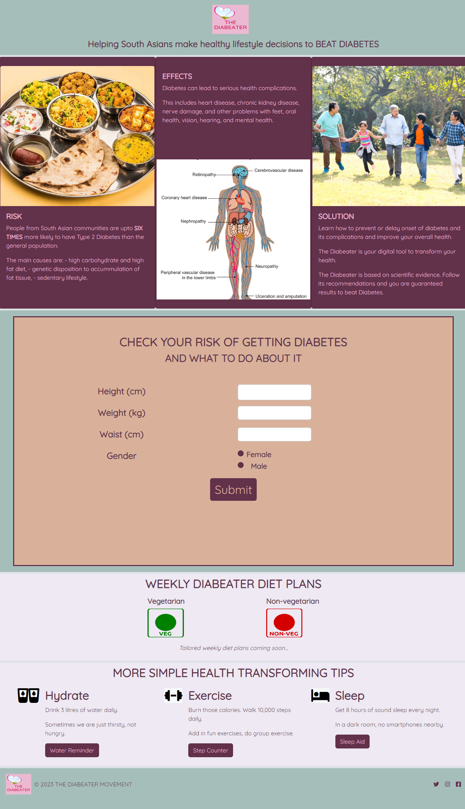

---

## CONTENTS  
  
* [UXD (User Experience)](#user-experience-ux)
  * [User Stories](#user-stories) 
* [Creation Process (Strategy -> Surface)](#creation-process)
  * [1.Strategy](#1-strategy)
  * [2. Scope](#2-scope)
  * [3. Structure](#3-structure)
  * [4. Skeleton](#4-skeleton)
  * [Wireframes](#wireframes)
  * [5. Surface](#5-surface)
* [Design](#design)
  * [Colour Scheme](#color-scheme)
  * [Typography](#typography)
  * [Imagery](#imagery)
* [Page Features](#page-features)
  * [Navigation Bar](#navigation-bar)
  * [Card Facts](#card-facts)
  * [Form](#form)
  * [Solutions](#solution)
  * [Footer](#footer)
* [Future Features](#future-features)
* [Technologies Used](#technologies-used)
  * [Languages Used](#languages-used)
  * [Frameworks, Libraries, Technologies & Programs Used](#frameworks-libraries-technologies--programs-used)
* [Deployment](#deployment)
  * [How to deploy](#how-to-deploy)
* [Testing](#testing)
  * [HTML Validation using W3C Validation](#html-validation-using-w3c-validation)
  * [CSS Validation using W3C Validation](#css-validation-using-w3c-validation)
  * [JavaScript Validation using JSHint](#js-validation-using-JSHint)
  * [Lighthouse scores via Chrome Developer Tools](#lighthouse-scores-via-chrome-developer-tools)
  * [Bugs & Fixes](#bugs--fixes)
  * [Unsolved Bugs](#unsolved-bugs)
* [Credits](#credits) 

---    

## User Experience (UX)  
  
### **User Stories**  

### **Primary Goal**  
  
The Diabeater is a digital tool for South Asians to diagnose their risk of getting diabetes and the measures they should take to alleviate this risk.

### **Visitor Goals** 

- The website is intended to be accessed by South Asians seeking to make a quick health risk assessment. 
 
- Keeping the above in mind, the website is straight to the point and easy to navigate for those seeking information about the building, its location and the history of the area. 

- The website has been designed to be responsive to allow visitors to view it from a range of devices, especially mobiles and smartphones. 

### **First Time Visitor**
- A user can access the interactive diabetes risk assessment form whic is located halfway down on the landing page.  

### **Returning Visitor**  
- Visitors are encouraged to return to the site and regularly check their diabetes risk assessment.  When the new diet recipe module is up and running the users will be able to generate their weekly diet plans and so engage further with the website.     
  
--- 

## Creation Process  
  
### **1. Strategy**  

- The strategy was to build an easy-to-click & follow, simple, non-intimidatory website that delivers clear information about diabetes and measures that the user should take to prevent it.  
- As the user is required to interact with the tool, the entire website needed to be inviting, with the use of consistent and neat design, graphics, precise wording and colour.  
- Mobile responsiveness is an essential feature required for this website.
  
### **2. Scope**  

- The Diabeater website must be available on a wide range of devices due to the age range of the users being targetted. 
- The site is to contain only essential information presented artistically using the best utility function for each page.  
- Text must be clear and legible on any sized device to allow the user access to all the information.  
- Future development is to include the ability for a user to set up their account on The Diabeater.  Users will then have access to create their weekly diet plans within the parameters suggested by The Diabeater (this requires API integration of the Recipe database from Edamam) and view live prices for a shopping trolley made up of the main ingredients of the recipes in their chosen diet plan (this requires API integration to a major UK supermarket).   
  
### **3. Structure**  

- The website is currrently set up as a single landing page with scroll down simple navigation.  
- The interactive form is halfway down the landing page and designed with Javascript to provide swift feedback to users.  The button on the form is easy to identify, its purpose clearly stated and large size so as to assist users of all ages and improve partipation rates.  sy to identify, clickable buttons and links with a consistent layout have been used in the navigation bar and footer.  
  
### **4. Skeleton**  

- The site was developed to be simple, clear and educational.  
- It is kept to one landing page style only.  
- The navbar contains a centred logo with a tag line underneath it.
- The next section highlights information about diabetes set out in 3 card styles with image top and text bottom - pattern reversed for the middle card.  
- This leads to the form to be completed by the user and empty space which gives feedback.
- The next section sets out examples of diabetes-beating diets and other helpful tips.  
- The landing page ends with the footer, which shows the logo and copyright label on the left and the social media links on the right.
   

### Wireframe 

Wireframe of the landing page
  

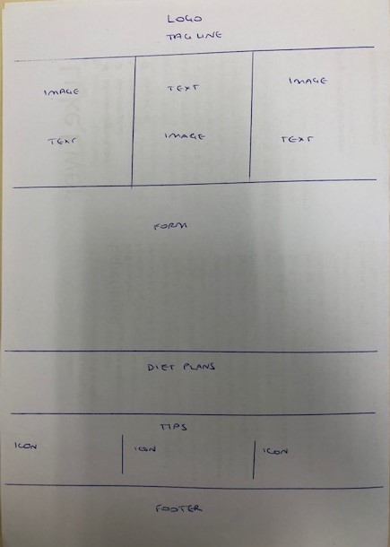
            

### **5. Surface**  

- A design was created that allowed a simple consistent fluid information flow down the landing page.     
- A palette of colours evoking a healthy diet was chosen as the main method to beat diabetes is through changing one's diet. 
- The Quicksand font is a display sans serif with rounded terminals in regular weight was used which is easy to read gives a soft inviting feel to a subject most people want ignore/put on the bottom shelf.   
  
## Design  

### **Color Scheme**  

- I did a Google search to identify the current vogue 'diet' colors and then used [Adobe Color](https://www.adobe.com/uk/products/color.html) to generate the palette used in The Diabeater.  

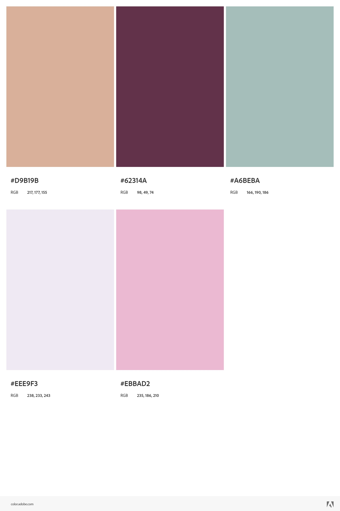

- An integrated play of 4 main colours of the colour palette has been made throughout the landing page and one colour reserved as the background colour for the logo.  These pastel colours are soothing and encouraging and totally captivate the user to engage and then spur them to make transformational changes - even those who've only ever had a fleeting thought on how to fight the diabetes disease.  

  
### **Typography**  
  
- [Google Fonts](https://fonts.google.com/) was used to import the font 'Quicksand'.  The Quicksand font is a display sans-serif font so it is eye-catching and draws the user through the page/form and feedback. The regular font weight is used.
  
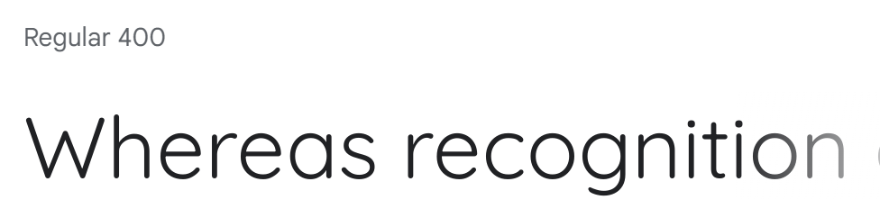

        
### **Imagery**  
  
- I have used minimal imagery so as not to visually overload the user and focused mainly on modern universally known icons: 
  *	3 royalty free images 
  * Fontawesome icons
- I have attributed the sources of the images used in the [Credits](#credits) section of this README doc.

---  
  
## Page Features  

### **Navigation Bar**   

  

#### **Desktop View**  

#### **Mobile View** 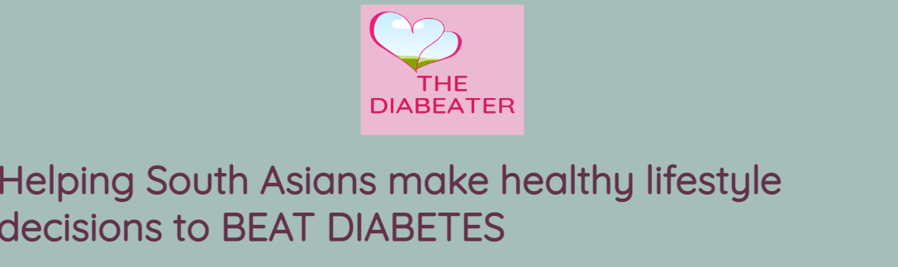 

This remains the same in portrait/landscape and mobile/desktop views.  However, the tagline is only partly responsive in the mobile view as it does not center on the screen.
  
   

### **Card Facts** 

  

#### **Desktop View** 
 

#### **Mobile View** 
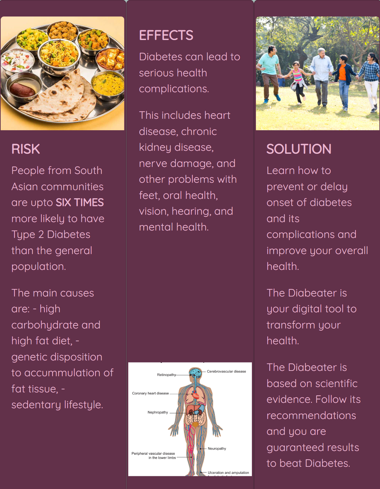

The card facts sections remains the same across all devices, in portrait/landscape and mobile/desktop views.  The columns become slimmer for smaller screens.  

  

### **Form** 

  

#### **Desktop View** 
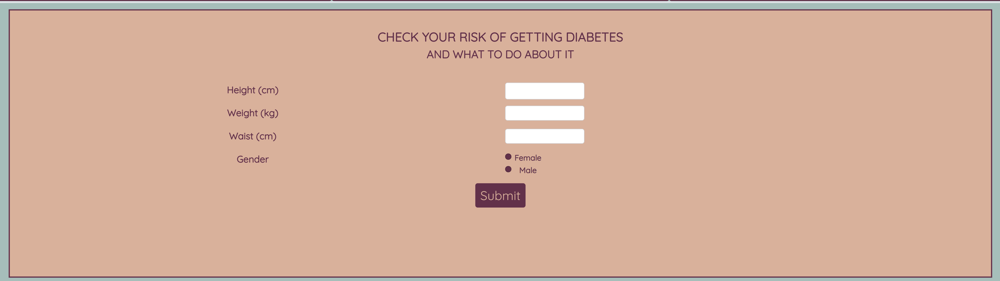 

#### **Mobile View** 
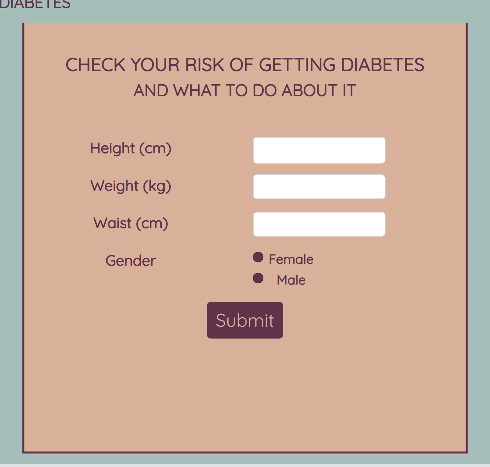 

The form section requires input in all fields and checking of either one of the radio buttons.  Once the Submit button is pressed, the Javascript code runs which provides the feedback as below:

#### **Desktop View** 
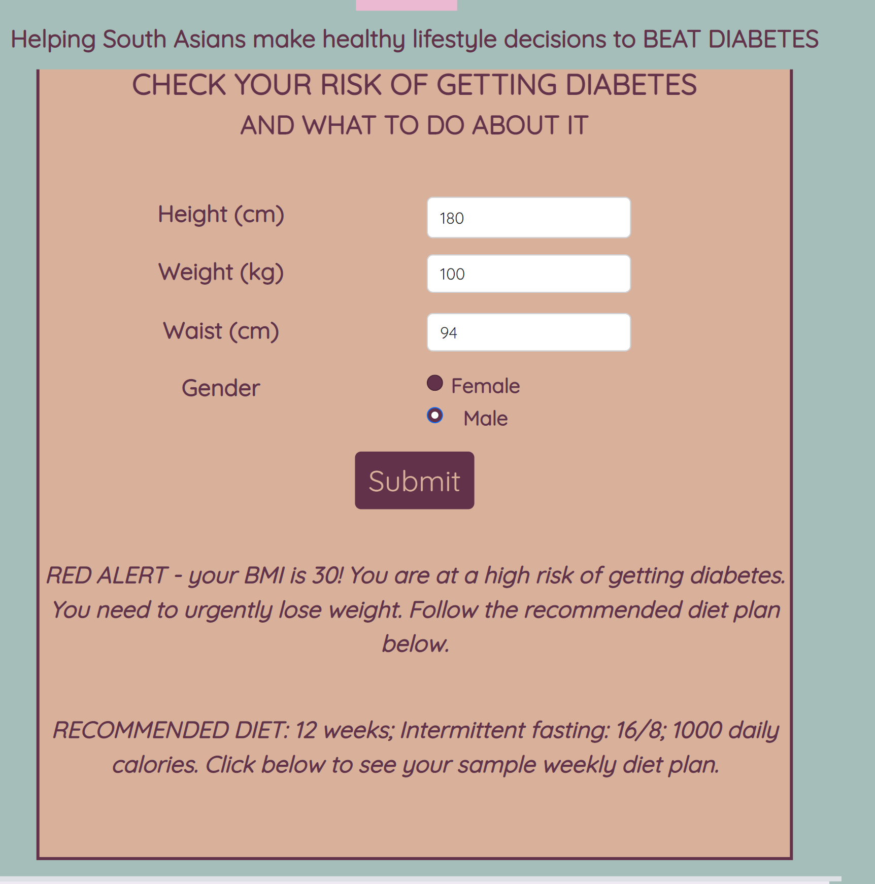 
  

### **Solutions**

#### **Desktop View**
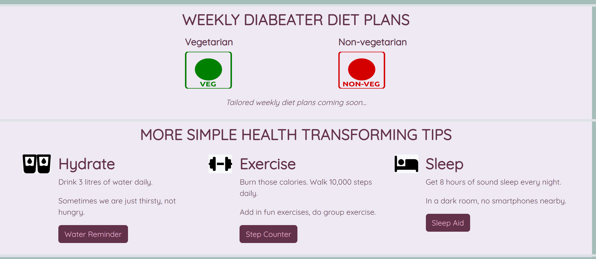

#### **Mobile View**
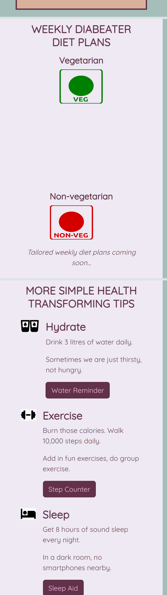

The content is the same for portrait/landscape views and for all screen sizes but for repsosnivity it stacks vertically for smaller screens.

### **Footer**  

#### **Desktop View** 
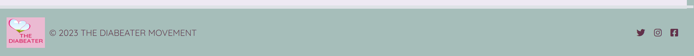 

#### **Mobile View** 
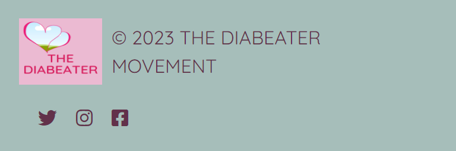 

The footer always shows the miniature form of the logo, the copyright label and social media icons and is responsive for all views.    

 

---  
                              

## Future Features  

- For future development, I would like to be able to:
  Users will then have access to create their weekly diet plans within the parameters suggested by The Diabeater (this requires API integration of the Recipe database from Edamam) and view live prices for a shopping trolley made up of the main ingredients of the recipes in their chosen diet plan (this requires API integration to a major UK supermarket).  

 * include the ability for a user to set up their account on The Diabeater.   
 * create functionality so that users will then have access to create their weekly diet plans within the parameters suggested by The Diabeater  - this requires API integration of the Recipe database from Edamam into The Diabeater
 * view live prices for a shopping trolley made up of the main ingredients of the recipes in their chosen recipes in the weekly diet plan  - this requires an API integration from a major UK supermarket.
  
---   
  

## Technologies Used    

### **Languages Used**   

- HTML5
- CSS3
- Javascript

### **Frameworks, Libraries, Technologies & Programs Used**  

- Bootstrap version 5.2.3 – examples and icons – these assisted with styling and responsiveness of website
- Fontawesome icons
- Freesvg icons
- Stockoverflow – to look up code
- W3 Schools – to look up code
- Gitpod - used for version control by utilising the Gitpod terminal to commit and push to GitHub
- GitHub - used to save and store all files for this website after being pushed from Gitpod
- Userpersona - to generate typical users of this website and ensure their pain points were alleviated by the website
- Figma – I did not have the time to use this given the tight project deadline so I sketched the wirteframe using pen and paper 
- Adobe Color – for colour palettes
- Canva – for designing the logo
- Google Fonts – font was imported from here 
- Google Dev Tools - to debug and for testing responsiveness 
- Google Lighthouse - for auditing the website
- W3C Validator - for validating the HTML and CSS code 
- JSHint - for validating the Javascript code

---   
 

## Deployment

### **How to deploy**  

GitHub was used to deploy the website. These were the steps taken to achieve this:  

1. Login to GitHub account
2. Navigate to the project repository: The-Diabeater
3. Click the Settings button near the top of the page
4. In the left-hand menu, find and click on the Pages button
5. In the Source section, choose 'main' from the drop-down, select branch menu
6. Select 'root' from the drop-down folder menu
7. Click 'Save' and after a few moments the project will have been made live and a link is visible at the top of the page

 

---  
    

## Testing  

- I had planned for this site to be accessible and legible on all screen sizes, and given its current functionality, expecially on smaller screens of smartphones. 

- I extensively used Chrome Dev Tools to test, tweak and debug throughout the build phase.  Testing was also done on desktop, laptop, iPhone and Android mobile devices.   
  
The results of the form feature testing are as follows:  
  
| Page | Test | Pass/Fail |
| :----| :----| :--------:|
| All  | Form input to be correctly populated | Pass |
| All  | Javascript functionality and calculations being carried out | Pass |
| All  | Feedback provided | Pass |
| All  | Refresh of page resets the form | Pass |

 
### **HTML Validation using W3C Validation**  

Index/landing page HTML validation
  

   

- All the pages passed the W3C HTML validation.

   

### **CSS Validation using W3C Validation** 

CSS validation
  

   

   

### **JavaScript Validation using JSHint** 

Javascript validation
  

   

   

### **Lighthouse scores via Chrome Developer Tools**   
  
For Desktop   

Lighthouse audit for Home page
  

 

Lighthouse audit for Cobalt Building page
  

Lighthouse audit for Location page
  

      

Lighthouse audit for History page
  

 

 
  
For Mobile   

Lighthouse audit for Home page
  

 

Lighthouse audit for Cobalt Building page
  

Lighthouse audit for Location page
  

      

Lighthouse audit for History page
  

 
  
### **Bugs & Fixes**  
  
  - There were a number of bugs which I fixed during the build phase and the two main ones are as below.

| Bug | Section | Fix |
| :----| :----| :--------:|
| Nesting button element in an anchor element | Navigation Bar | When running the W3C validation test, I discovered that I had made an error by placing a button element inside an anchor element for the Leaseholder Portal button. Semantically, this was incorrect. I was trying to put a hyperlink in a button.  The options to solve this were presented in this [article](https://testbook.com/web-development/how-to-create-an-html-button-that-acts-like-a-link#:~:text=You%20can%20use%20the%20OnClick,to%20define%20the%20link%20address.) and I changed the code as per Option 1.  I re-checked my HTML code with W3C Validator and my site to find the issue resolved. |
| br element in li element  | Footer |  Semantically I made an error by using the br element to make space between the social icons in the footer. On performing the W3C validation test, I became aware of this error. I experimented by (1) putting separate divs for each social media icon and (2) putting each social media item in a separate ul and li combination.  Option (2) worked and the W3C Validator passed my HTML code.|

### **Unsolved Bugs** 

- Some of the Location page masonry images lie on top of the footer when this page is opened first.  I have not managed to understand why this happens so I will keep researching to solve this issue.
- I was not able to make the the Leaseholder Portal button in the navigation bar fully responsive so I had to remove it for smaller screen views.  I will try to find out the reason for this and then find a solution.
- The footer responsiveness also needs to be improved so that all the 4 columns fit for all screen views.  I will continue to look for a solution for this.  

 
---  

## Credits  
  
### **Content References**
- All the content for the website has been written by myself, based on my extensive research
- [Code Institute](https://codeinstitute.net/ie/) for their HTML, CSS, & Bootstrap learning material
- [W3Schools](https://www.w3schools.com/) for additional learning material
- [Bootstrap example for masonry](https://getbootstrap.com/docs/5.0/examples/masonry/)
- [Codepen](https://codepen.io/Maxalos/pen/MXXqGj) for the stylish vertical responsive timeline
- Fred Rodgers – a neighbour and long-term Barbican resident who provided his paper on the history of the Barbican Wildlife Garden and pointed out further resources to me
- Jonathan Spengler who pointed me to Caroline Sandes' 2018 academic paper on the THE BARBICAN BEFORE BARBICAN: THE HOUSE, ITS HISTORY AND THE ‘IMAGINARY’ WATCHTOWER
- Amy Richardson - developer of SCOOPS website - for README structure
  
### **Media References**  
  
- [London Metropolitan Archives](https://www.cityoflondon.gov.uk/things-to-do/history-and-heritage/london-metropolitan-archives)
- [British Museum](https://www.britishmuseum.org/)
- [British History Online]( https://www.british-history.ac.uk/)
- [The interactive Ogilby & Morgan Large Scale Map of London as Rebuilt in 1676](https://www.british-history.ac.uk/no-series/london-map-ogilby-morgan/1676) 
- [The interactive MOEM AGAS Map](https://mapoflondon.uvic.ca/map.htm)
- [Old & New London by Thornbury & Edmond book](https://www.british-history.ac.uk/old-new-london/vol1/pp1-16)
- The 1995 Marketing Brochure for the Cobalt Building
- [Dexters estate agents' photos of apartments for rent in Bridgewater Square](https://www.dexters.co.uk/property-lettings/flats-to-rent-in-bridgewater-square)
- [Dreamtime city of London panorama photo](https://www.dreamstime.com/stock-photo-city-london-panorama-image46882167)
- [Google Maps](https://www.google.com/maps) for the map used in this website

### **Acknowledgements** 

- I would like to express my deepest gratitude to our Bootcamp instructor Richey Malhotra for his patience and guidance and most of all for setting me up with the stylised hero image for the home page of this website.
- I am grateful for the support and help given by my Bootcamp cohort colleagues Rob, Rosie and Sharon for debugging and design.   
- I am thankful to WAES and the Code Institute for providing this unique opportunity for me to upskill and learn Digital Skills.
- Last but not least, I am grateful to my sister for looking after our parents so that I have been able to devote time to learning the technology and creating this website.

### **Reflections** 

- This is my first website project from scratch.  
- Initially, I found it a giant task as a) none of my code would work and b) I was researching the subject matter as I wanted to create a meaningful and value-adding publically available website.  However, following the principles as taught on this Bootcamp to date (Jan 2023) and once the home page began to take shape, my confidence in coding and using Bootstrap grew.  I was then able to work through the rest of the website more comfortably.  However, I did decide, to build a demo site first and then copied that across to this site (therefore my commits are fewer here).  
- I have learnt how important patience and systematic thinking are for software development and that such an approach does indeed deliver results.  
- I am also tremendously pleased and excited that the website fully reflects the vision I had of it at the beginning of this project!      