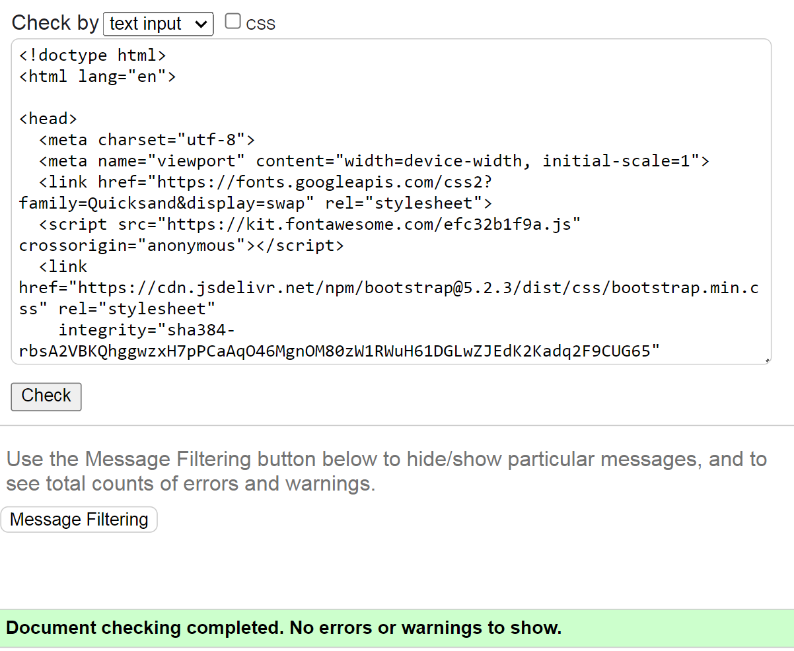
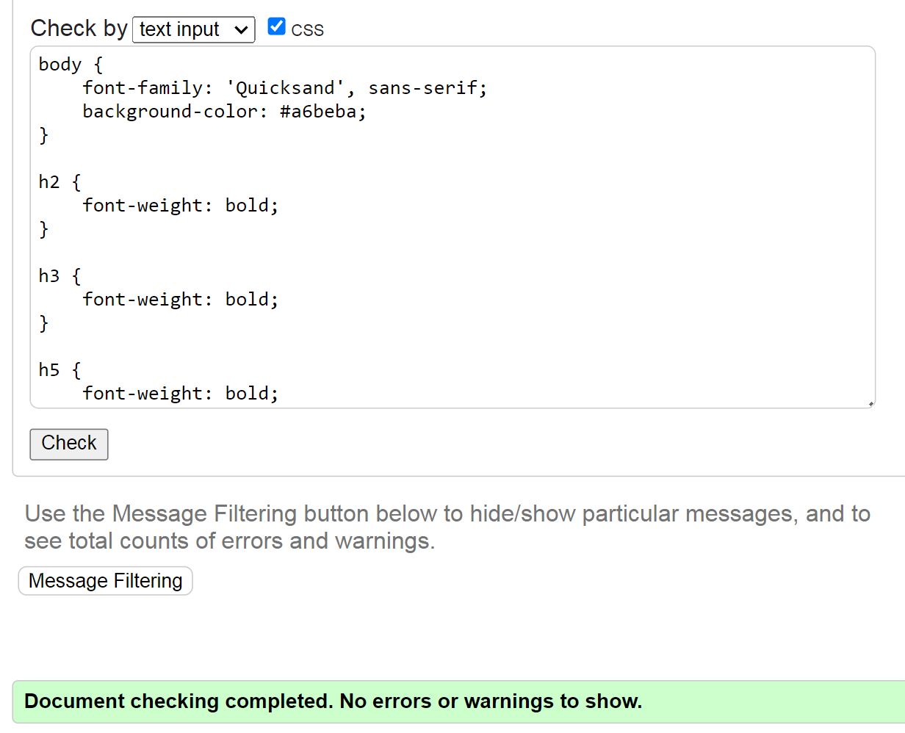
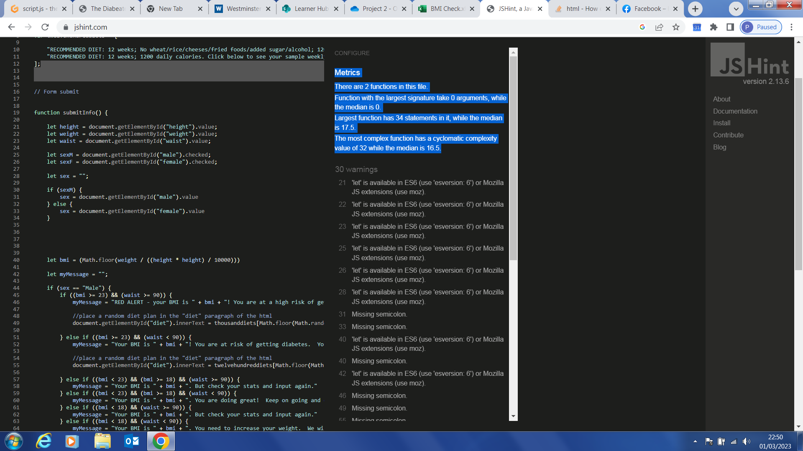
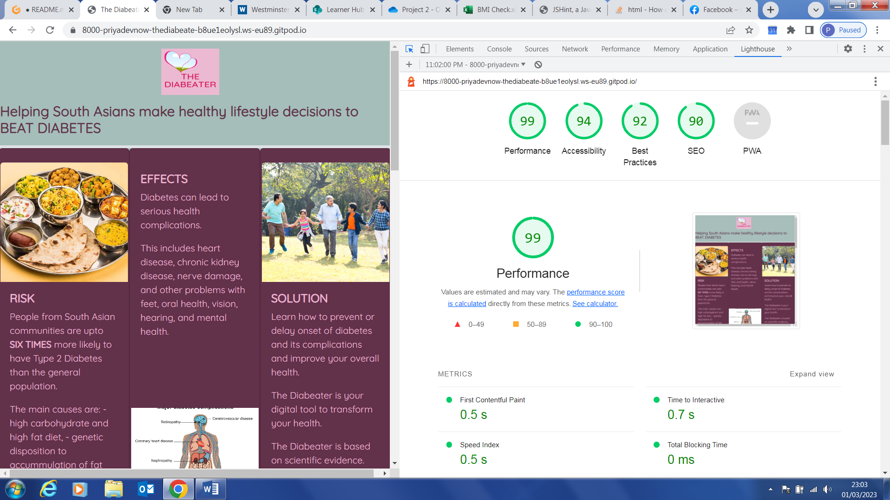

# The Diabeater
[View live project here on GitHub](https://priyadevnow.github.io/the-diabeater/)

The Diabeater is an interactive tool for South Asians to assess their risk of getting Type 2 diabetes and then providing diet plans and other tips to transform their lifestyle.   

   
  

---

## CONTENTS  
  
* [UXD (User Experience)](#user-experience-ux)
  * [User Stories](#user-stories) 
* [Creation Process (Strategy -> Surface)](#creation-process)
  * [1.Strategy](#1-strategy)
  * [2. Scope](#2-scope)
  * [3. Structure](#3-structure)
  * [4. Skeleton](#4-skeleton)
  * [Wireframes](#wireframes)
  * [5. Surface](#5-surface)
* [Design](#design)
  * [Colour Scheme](#color-scheme)
  * [Typography](#typography)
  * [Imagery](#imagery)
* [Page Features](#page-features)
  * [Navigation Bar](#navigation-bar)
  * [Card Facts](#card-facts)
  * [Form](#form)
  * [Solutions](#solution)
  * [Footer](#footer)
* [Future Features](#future-features)
* [Technologies Used](#technologies-used)
  * [Languages Used](#languages-used)
  * [Frameworks, Libraries, Technologies & Programs Used](#frameworks-libraries-technologies--programs-used)
* [Deployment](#deployment)
  * [How to deploy](#how-to-deploy)
* [Testing](#testing)
  * [HTML Validation using W3C Validation](#html-validation-using-w3c-validation)
  * [CSS Validation using W3C Validation](#css-validation-using-w3c-validation)
  * [JavaScript Validation using JSHint](#js-validation-using-JSHint)
  * [Lighthouse scores via Chrome Developer Tools](#lighthouse-scores-via-chrome-developer-tools)
  * [Bugs & Fixes](#bugs--fixes)
* [Credits](#credits) 

---    

## User Experience (UX)  
  
### **User Stories**  

### **Primary Goal**  
  
The Diabeater is a digital tool for South Asians to diagnose their risk of getting diabetes and the measures they should take to alleviate this risk.

### **Visitor Goals** 

- The website is intended to be accessed by South Asians of all ages seeking to make a quick health risk assessment of diabetes. 
 
- Keeping the above in mind, the website is straight to the point and easy to navigate.  

- The website has been designed to be responsive to allow visitors to view it from a range of devices, especially mobiles and smartphones. 

### **First Time Visitor**
- A user can quickly access the interactive diabetes risk assessment form which is located halfway down on the landing page.  

### **Returning Visitor**  
- Visitors are encouraged to return to the site and regularly check their diabetes risk assessment.  When the new diet recipe module is up and running the users will be able to generate their weekly diet plans and so engage further with this website.     
  
--- 

## Creation Process  
  
### **1. Strategy**  

- The strategy was to build an easy-to-click & follow, simple, non-intimidatory website that delivers clear information about diabetes and measures that the user should take to prevent it.  
- As the main thrust of the website is the interactive form tool, the website needed to be inviting, with the use of 'less is more' design, graphics and precise wording.  
- Mobile responsiveness is an essential feature required for this website.
- HTML5 and CSS3 were used to build an inviting front-end landing page.
- Javascript was used to build the interactive form tool. 
  
### **2. Scope**  

- The Diabeater landing page must be available on a wide range of devices due to the age range of the users being targetted.  
- Text must be clear and legible on any sized device to allow the user access to all the information. 
- The landing page must have the functional form tool (this is key as it will then lead into and cater for future development as below).
- Future development is to include the ability for a user to set up their account on The Diabeater.  Users will then be able to create their weekly diet plans within the diet plan parameters recommedned by The Diabeater (this requires API integration of the Recipe database from Edamam) and view live prices for a shopping trolley made up of the main ingredients of their chosen recipes (this requires API integration to a major UK supermarket).   
  
### **3. Structure**  

- The website is currrently set up as a single landing page with simple scroll down navigation.  
- The key interactive form is halfway down the landing page and designed with Javascript to provide swift feedback to users.  The button on the form is easy to identify, its purpose clearly stated and large size to emphasize that it needs to be clicked for something to happen.  
- A consistent matching layout has been used in the navigation bar and footer.  
  
### **4. Skeleton**  

- The landing page was developed to be simple, clear, interactive and informative.  
- The content is kept to a single landing page only.  
- The navigation bar contains a centred logo with a tag line underneath it.
- The next section highlights information about diabetes set out in 3 card styles with image top and text bottom - pattern reversed for the middle card.  
- This leads to the interactive form to be completed by the user and empty space below the space for feedback.
- The next section sets out examples of diabetes-beating diets and other helpful tips.  
- The landing page ends with the footer, which shows the logo and copyright label on the left and the social media links on the right.
   

### Wireframe 

Wireframe of the landing page
  

            

### **5. Surface**  

- A design was created that allowed a simple consistent fluid information flow down the landing page.     
- A palette of colours evoking a healthy diet was chosen as the main method to beat diabetes is through changing one's diet. 
- The Quicksand font in regular weight was used as it is a display sans serif font with rounded terminals which is easy to read gives a soft inviting feel to a subject most people want ignore/put on the bottom shelf.   
  
## Design  

### **Color Scheme**  

- I did a Google search to identify the current vogue 'diet' colors and then used [Adobe Color](https://www.adobe.com/uk/products/color.html) to generate the palette used in The Diabeater.  

- An integrated play of 4 main colours of the colour palette has been made throughout the landing page and one colour reserved as the background colour for the logo.  These pastel colours are soothing and encouraging and totally captivate the user to engage and then spur them into action to make transformational changes as recommended by The Diabeater - even those who've only ever had a fleeting thought on how to fight the diabetes disease.  

  
### **Typography**  
  
- [Google Fonts](https://fonts.google.com/) was used to import the font 'Quicksand'.  The Quicksand font is a display sans-serif font so it is eye-catching and draws the user through the page, form and feedback. The regular font weight has been used.
  

        
### **Imagery**  
  
- I have used minimal imagery so as not to visually overload the user and retain the informative natur eof this landing page.  Where used, I have focused on modern universally known icons.  Imagery used: 
  *	3 royalty free images 
  * Fontawesome icons
- I have attributed the sources of the images used in the [Credits](#credits) section of this README doc.

---  
  
## Page Features  

### **Navigation Bar**   

  

#### **Desktop View**  

#### **Mobile View**  

This remains the same in portrait/landscape and mobile/desktop views.  However, the tagline is only partly responsive in the mobile view as it does not center on the screen but aligns to the left.
  
   

### **Card Facts** 

  

#### **Desktop View** 
 

#### **Mobile View** 

The card facts sections remains the same across all devices, in portrait/landscape and mobile/desktop views.  The columns become slimmer for smaller screens.  

  

### **Form** 

  

This is the key item of this landing page.  The functionality has been created using Javascript.

 

#### **Desktop View** 
 

#### **Mobile View** 
 

The form section requires input in all fields and checking of either one of the radio buttons.  

Once the Submit button is pressed, the Javascript code runs.  

The code is formatted as thus:
 - global variables of two recommended diet plans are declared (each with two choices) which can be accessed from anywhere in the rest of the code  
 - once the submit button has been pressed, the bmi calculation is run and feedback (myMessage) is given below the form as per the main algorithmn which checks the bmi/waist/sex parameters
- then and depending on the degree of risk of diabetes, further feedback is given on the recommended diet plan which randomly calls one of two potential choices offered per the relevant recommended diet plan stated in the global variable.  This section is not triggered where there is no risk of diabetes assessed by the algorithmn
- See below feedback for a user who is at high risk of diabetes, thus triggering the recommended diet plan:

#### **Desktop View** 
 
  

### **Solutions**

 This is made of two sections which show diet recipe plans and other tips to transform health.  

Ideally I would have liked to only show the diet recipe plan where recommended in the feedback from the form.  I will build this functionality in the next version of this landing page.  Hence, currently rudimentary diet plans are shown and other general health tips.

#### **Desktop View**

#### **Mobile View**

The content is the same for portrait/landscape views and for all screen sizes but for resposivity these two sections stack vertically for smaller screens.

### **Footer**  

#### **Desktop View** 
 

#### **Mobile View** 
 

The footer always shows the miniature form of the logo, the copyright label and social media icons and is responsive for all views.    

 

---  
                              
## Future Features  

For future development, I would like to be able to:
 * include the ability for a user to set up their account on The Diabeater 
 * create functionality so that users will then have access to create their weekly diet plans within the key parameters suggested by The Diabeater - this requires API integration of the Recipe database from Edamam into The Diabeater
 * view live prices for a shopping trolley made up of the main ingredients of the recipes in their chosen recipes in the weekly diet plan - this requires an API integration from a major UK supermarket
  
---   
  

## Technologies Used    

### **Languages Used**   

- HTML5
- CSS3
- Javascript

### **Frameworks, Libraries, Technologies & Programs Used**  

- Bootstrap version 5.2.3 – examples – these assisted with styling and responsiveness of website
- Fontawesome icons
- Freesvg icons
- Stockoverflow – to look up code
- W3 Schools – to look up code
- Gitpod - used for version control by utilising the Gitpod terminal to commit and push to GitHub
- GitHub - used to save and store all files for this website after being pushed from Gitpod
- Figma – I did not have the time to use this given the tight project deadline so I sketched the wirteframe using pen and paper 
- Adobe Color – for colour palettes
- Canva – for designing the logo
- Google Fonts – font was imported from here 
- Google Dev Tools - to debug and for testing responsiveness 
- Google Lighthouse - for auditing the website
- W3C Validator - for validating the HTML and CSS code 
- JSHint - for validating the Javascript code

---   
 

## Deployment

### **How to deploy**  

GitHub was used to deploy the website. These were the steps taken to achieve this:  

1. Login to GitHub account
2. Navigate to the project repository: The-Diabeater
3. Click the Settings button near the top of the page
4. In the left-hand menu, find and click on the Pages button
5. In the Source section, choose 'main' from the drop-down, select branch menu
6. Select 'root' from the drop-down folder menu
7. Click 'Save' and after a few moments the project will have been made live and a link is visible at the top of the page

 

---  
    

## Testing  

- I had planned for this site to be accessible and legible on all screen sizes, and given its current functionality, expecially on smaller screens of smartphones. 
- The main testing done focused on making sure that the JavaScript functionality worked.  A number of different scenarios were tested and compared to calculations done in Excel to ensure the correct feedback was beign given.   

- I extensively used Chrome Dev Tools to test, tweak and debug throughout the build phase.  Testing was also done on desktop, laptop, iPhone and Android mobile devices.   
  
The results of the form feature testing are as follows:  
  
| Page | Test | Pass/Fail |
| :----| :----| :--------:|
| All  | Form input to be correctly populated | Pass |
| All  | Javascript functionality and calculations being carried out | Pass |
| All  | Feedback provided | Pass |
| All  | Refresh of page resets the form | Pass |

 
### **HTML Validation using W3C Validation**  

Landing page HTML validation
  

   
- The W3C HTML validation was passed.

   

### **CSS Validation using W3C Validation** 

CSS validation
  

   
 - The W3C CSS validation was passed.

   

### **JavaScript Validation using JSHint** 

Javascript validation
  

   
 - The Javascript JSHint validation was passed.

   

### **Lighthouse scores via Chrome Developer Tools**   
  
For Desktop   

Lighthouse audit The Diabeater landing page
  

 
  
 
  
### **Bugs & Fixes**  
  
- There were a number of bugs which I fixed during the build phase but I have not been able to resolve the below.
- The form requires either one of the Gender buttons to be checked before submission.  I researched how this would be achieved and came across the following [article](https://stackoverflow.com/questions/22238368/how-can-i-require-at-least-one-checkbox-be-checked-before-a-form-can-be-submitte) on Stackoverflow.  I tried to implement the solution of 7 March 2014 but was not successful.  I will work through this again to see if I can find the solution for validation of the form for the radio buttons. 
- I also need to do further research so as to improve the responsivity of some of the aspects of the landing page for the smaller screens.

 
---  

## Credits  
  
### **Content References**
- All the content for the website has been written by myself, based on my extensive research
- [Code Institute](https://codeinstitute.net/ie/) for their HTML, CSS, Javascript & Bootstrap learning material
- [W3Schools](https://www.w3schools.com/) for additional learning material
- [Know Diabetes](https://www.knowdiabetes.org.uk/) for the 7 day meal plans

### **Media References**
- Diabetes medical poster
-[Bigstock photos - subodhsathe](https://www.bigstockphoto.com/image-126974009/stock-photo-group-of-indian-food-or-indian-thali,-south-indian-thali,-south-indian-complete-meal,-south-indian-complete-lunch,-indian-food-platter-or-indian-food-thali)
- [Getty Images - triloks](https://www.istockphoto.com/photo/multi-generation-indian-family-running-at-park-gm1200879955-344137066)

### **Acknowledgement** 

- I would like to express my deepest gratitude to our Bootcamp instructor Richey Malhotra for his patience and help with the Javascript coding for this project.  

    